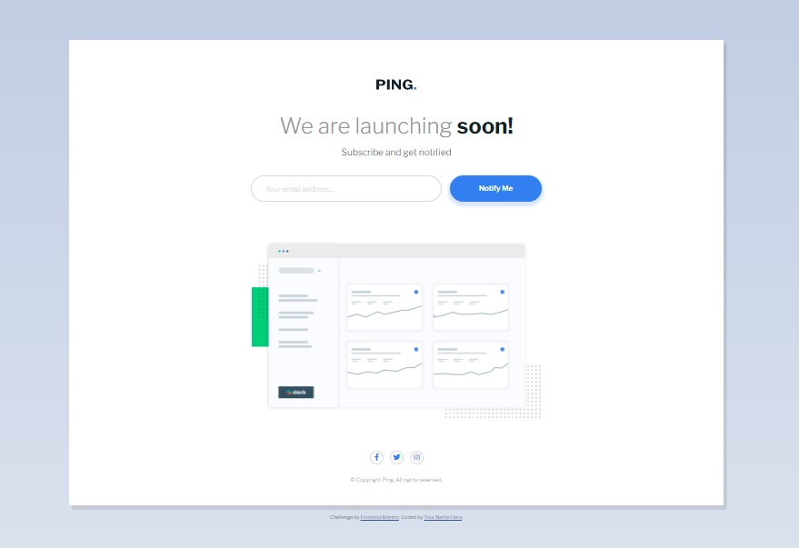
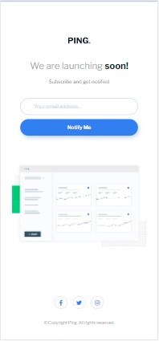
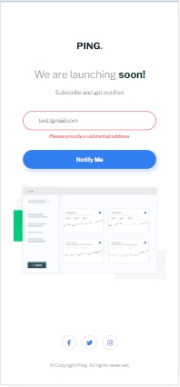

# Frontend Mentor - Ping coming soon page solution

This is a solution to the [Ping coming soon page challenge on Frontend Mentor](https://www.frontendmentor.io/challenges/ping-single-column-coming-soon-page-5cadd051fec04111f7b848da). Frontend Mentor challenges help you improve your coding skills by building realistic projects. 

## Table of contents

- [Overview](#overview)
  - [The challenge](#the-challenge)
  - [Screenshot](#screenshot)
  - [Links](#links)
- [My process](#my-process)
  - [Built with](#built-with)
  - [What I learned](#what-i-learned)
  - [Continued development](#continued-development)
  - [Useful resources](#useful-resources)
- [Author](#author)
- [Acknowledgments](#acknowledgments)

## Overview

### The challenge

Users should be able to:

- View the optimal layout for the site depending on their device's screen size
- See hover states for all interactive elements on the page
- Submit their email address using an `input` field
- Receive an error message when the `form` is submitted if:
	- The `input` field is empty. The message for this error should say *"Whoops! It looks like you forgot to add your email"*
	- The email address is not formatted correctly (i.e. a correct email address should have this structure: `name@host.tld`). The message for this error should say *"Please provide a valid email address"*

### Screenshot

| Desktop layout |
|:--:|

| Mobile layout |
|:--:|
 

### Links

- Solution URL: https://github.com/PavlinaPs/ping-coming-soon-page
- Live Site URL: https://pavlinaps.github.io/ping-coming-soon-page/

## My process

### Built with

- Semantic HTML5 markup
- CSS custom properties
- Flexbox
- Mobile-first workflow
- Sass
- BEM

### What I learned

I need to read the README file first and thoroughly! I had all done and then found out there should be a different error message if no email is entered than the one in design file. Fortunately it didn't need much changes.

When checking the live site in HTML validator I received this error for the social links:
"Error: The element \<a> must not appear as a descendant of the \<button> element."
It makes sense, when I think of it. Refactored to a list.

### Continued development

I would like to use more nesting in Sass, I sometimes forget it is possible, even with media queries.

### Useful resources

- [Sass, BEM, & Responsive Design (4 hr beginners course)](https://youtu.be/jfMHA8SqUL4?t=1) by Coder Coder. I already know most of it, I watch these videos anyway, I always find something useful. 

## Author

- GitHub - [PavlinaPs](https://github.com/PavlinaPs)
- Frontend Mentor - [@PavlinaPs](https://www.frontendmentor.io/profile/PavlinaPs)

## Acknowledgments

It is great that I can solve Frontend Mentor's challenges. They are all very useful for me. Every single one. Thank you!
